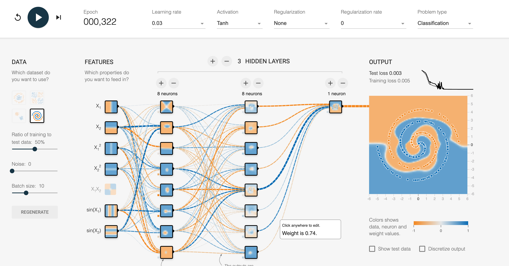

    

        
© Albert Palacios Jiménez, 2024

    

    

        
    

 

# Classificació d'imatges

La **classificació d'imatges** funciona de manera similar a la **classificació de texts** però amb arxius d'imatge.

Igualment la classificació es fa en dues fases:

- **Train** (entrenament), en aquesta fase mostrem molts exemples dels dos tipus que volem classificar per entrenar la xarxa
- **Classify** (classificació), fer servir la xarxa entrenada per classificar nous objectes a partir del què la xarxa ha après dels exemples durant l'entrenament

Com que per entrenar una xarxa fan falta molts arxius d'imatge, els guardem en arxius **.zip**:

- L'arxiu **"./data/training.zip"**, un cop descomprimit genera la carpeta **"./data/training"** que conté les dades amb les que entrenarem la xarxa.

    Al descomprimir-lo, les **etiquetes** que representen cada imatge estàn dins de la seva pròpia carpeta. Als exemples són les carpetes *"cat/non_cat"* i *"bus, family, jeep, racing, taxi, truck"

- L'arxiu **"./data/testing.zip"**, un cop descomprimit genera la carpeta **"./data/testing"** que té imatges aleatòries que compleixen i no compleixen la condició, per poder testejar la xarxa entrenada.

Als exemples tenim dos programes **Python**:

- **"ai_train.py"** entrena una xarxa neural amb les dades de **"./data/training.zip"**

- **"ai_classify.py"** fa servir la xarxa entrenada per classificar nous exemples, en aquest cas els exemples de **"./data/testing.zip"**

La xarxa es configura a través de l'arxiu **"model_config.json"**.

**Important:** L'arxiu d'entrenament **"ai_train.py"** genera dos arxius:

- **"model_metadata.json"** que conté la configuració de la xarxa que fa falta per poder-la fer servir al classificar

- **"model_network.pth"** que conté la xarxa entrenada durant la fase d'entrenament, i és l'encarregada de classificar noves fotos

**Nota:** Quan s'acaba d'entrenar o classificar la xarxa s'esborren les carpetes descomprimides, per estalviar espai.

# Vídeo classificant números

En aquest vídeo es veu una simulació de com poden afectar els pessos de cada neurona, a la hora de classificar una imatge (escriptura de números)

[Enllaç](https://www.facebook.com/watch/?mibextid=UalRPS&v=1073610870547722) al document original de Facebook

<video width="100%" controls allowfullscreen style="max-width: 90%; width: 400px; max-height: 250px">
  <source src="./assets/facebook-1073610870547722.mp4" type="video/mp4">
</video>

 

# Tensorflow playground

Per ententre millor com les capes ocultes d'una xarxa neural:

[Tensorflow playground](https://playground.tensorflow.org/)

 

 

 

- Es poden entrenar fins a 4 tipus de datasets diferents
- Es poden afegir i treure capes ocultes
- Es pot canviar la funció d'activació

- Mostra el pes que té cada neurona
- Mostra la capacitat de detecció de les dades del dataset