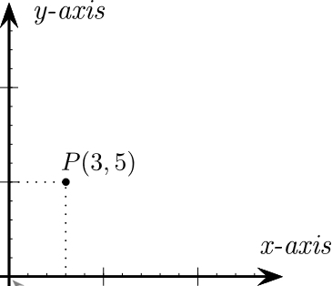

<div style="display: flex; width: 100%;">
    <div style="flex: 1; padding: 0px;">
        <p>© Albert Palacios Jiménez, 2024</p>
    </div>
    <div style="flex: 1; padding: 0px; text-align: right;">
        
    </div>
</div>
<br/>

# Generar PDF

A l'empresa, és habitual que s'hagin de generar arxius **Portable Document Format .pdf** a partir de dades de manera automàtica. 

Normalment són *cartes o documents* que s'envien a molts clients *amb dades personalitzades*, i es generen de manera automàtica.

Els llenguatges de programació solen tenir llibreries que ho fan possible. A Python hi ha *reportlab*:

```bash
pip install reportlab
```

O bé a macOS o Linux amb *brew*:
```bash
python3 -m pip install reportlab --break-system-package
```

## Arxius i canvas

Per crear un document *.pdf* amb *reportlab* només cal craer una superfície de dibuix **canvas** i escriure amb **drawString**.

Per definir la mida de la pàgina fem servir "A4" o la mida que ens calgui. Cada pàgina serà un *canvas* de dibuix*.

Al canvas si poden anar 'pintant' els objectes a sobre dels antics, així si volem netejar-lo i començar de nou:

<br/>
<center>
<br/></center>
<br/>
<br/>

Les coordenades del canvas de *reportlab* són **"Bottom-Left"** això vol dir que la posició (0,0) està a baix a l'esquerra.

<br/>
<center>
<br/></center>
<br/>
<br/>

**Exemple 0**

```python
#!/usr/bin/env python3
from reportlab.lib.pagesizes import A4
from reportlab.pdfgen import canvas

filename = 'hello.pdf'

# Crear el canvas
c = canvas.Canvas(filename, pagesize=A4)

# Afegir text a la pàgina
c.drawString(100, 750, "Hello World")

# Tancar i guardar el fitxer
c.save()
```

## Pàgines

Per definir la configuració de la pàgina, un cop creat el canvas, es fa:

```python
# Pàgina: horitzontal/landscape A4
c.setPageSize(landscape(A4))
width, height = landscape(A4)

# Pàgina: vertical A4
c.setPageSize(A4)
width, height = A4
```

Cal tenir en compte que es pot dibuixar a qualsevol part de la pàgina, així **si no es vol dibuixar fora dels 'marges' és el programador qui ha de vigilar** de no fer-ho

**Exemple 1**

```python
#!/usr/bin/env python3
from reportlab.lib.pagesizes import A4, landscape
from reportlab.pdfgen import canvas

filename = 'mixedpages.pdf'

def cm_to_points(cm):
    return cm * 28.35

# Crear el canvas
c = canvas.Canvas(filename)

# Dimensions dels marges (passar cm a points)
margin_h = cm_to_points(1)  # 1 cm
margin_v = cm_to_points(2)  # 2 cm

# Definir la mida i horientació
# de la primera pàgina: horitzontal/landscape A4
c.setPageSize(landscape(A4))
width, height = landscape(A4)

# Text de la pàgina
pos_y = height - margin_v
c.drawString(margin_h, pos_y, "Primera pàgina - Horitzontal A4")

# Rectangle línia per marcar marges
c.rect(margin_h, margin_v, width - 2 * margin_h, height - 2 * margin_v)

# Tancar la pàgina actual i començar-ne una de nova
c.showPage()

# Definir la mida i horientació
# de la segona pàgina: vertical A4
c.setPageSize(A4)
width, height = A4

# Text de la pàgina
pos_y = height - margin_v
c.drawString(margin_h, pos_y, "Segona pàgina - Vertical A4")

# Rectangle per marcar marges
c.rect(margin_h, margin_v, width - 2 * margin_h, height - 2 * margin_v)

# Tancar i guardar
c.save()
```

## Alineació de texts

Per fer textos alineats cal crear un **Pharagraph** amb un estil de text. A aquest objecte *pharagraph* cal definir-li la caixa que encapsula el text amb:

```python
# En aquest cas no es defineix cap limit d'altura
# fent servir "inf"
p.wrap(box["width"], float('inf')) 
```

Els tipus d'alineació són:

- **TA_LEFT**: Esquerra 
- **TA_CENTER**: Centrat 
- **TA_RIGHT**: Dreta 
- **TA_JUSTIFY**: Justificat 

**Exemple 2**

```python
#!/usr/bin/env python3

from reportlab.lib.pagesizes import A4
from reportlab.pdfgen import canvas
from reportlab.platypus import Paragraph
from reportlab.lib.styles import getSampleStyleSheet
from reportlab.lib.enums import TA_LEFT, TA_CENTER, TA_RIGHT, TA_JUSTIFY

filename = "align.pdf"

def draw_text(c, box, text, alignment):
    # Configura l'estil del text
    styles = getSampleStyleSheet()
    style = styles["Normal"]
    style.alignment = alignment

    # Crea el paràgraf i comprova si el text encaixa
    # Ajusta el text a l'ample i retorna l'espai necessari
    p = Paragraph(text, style)
    max_width, max_height = p.wrap(box["width"], float('inf'))  

    # Dibuixar el text ajustant l'origen a la part superior
    p.drawOn(c, box["x"], box["y"] - max_height)  

# Crear el canvas
c = canvas.Canvas(filename, pagesize=A4)

# Mides de la pàgina
page_width, page_height = A4

# Text Lorem Ipsum
lorem_text = (
    "Lorem ipsum dolor sit amet, consectetur adipiscing elit. "
    "Sed do eiusmod tempor incididunt ut labore et dolore magna aliqua."
)

# Configuració de marges i dimensions dels rectangles
rect_width = page_width / 2 - 50
rect_height = 100
margin_x = 50
margin_y = 50

# Definició dels rectangles com a diccionaris
rects = [
    {"x": margin_x, 
     "y": page_height - margin_y, 
     "width": rect_width - 10, 
     "height": rect_height, 
     "alignment": TA_LEFT, 
     "title": "Align left"},
    {"x": page_width - margin_x - rect_width, 
     "y": page_height - margin_y, 
     "width": rect_width - 10, 
     "height": rect_height, 
     "alignment": TA_CENTER, 
     "title": "Align center"},
    {"x": margin_x, 
     "y": page_height - 2 * (margin_y + rect_height), 
     "width": rect_width - 10, 
     "height": rect_height, 
     "alignment": TA_RIGHT, 
     "title": "Align right"},
    {"x": page_width - margin_x - rect_width, 
     "y": page_height - 2 * (margin_y + rect_height), 
     "width": rect_width - 10, 
     "height": rect_height, 
     "alignment": TA_JUSTIFY, 
     "title": "Align justify"},
]

# Dibuixar rectangles i textos
for rect in rects:
    # Dibuixa el rectangle
    c.rect(rect["x"], rect["y"] - rect["height"], rect["width"], rect["height"])
    # Escriu el títol
    draw_text(c, rect, rect["title"], TA_LEFT)
    # Escriu el text amb l'alineació especificada
    draw_text(c, {**rect, "y": rect["y"] - 20}, lorem_text, rect["alignment"])

# Tancar i guardar el PDF
c.save()
```

## Estils de texts

Els estils de text en *reportlab* es defineixen mitjançant objectes de tipus **ParagraphStyle**. Aquests estils permeten configurar atributs com:

- Font (`fontName`, `fontSize`, `leading`)
- Colors (`textColor`, `backColor`)
- Marges (`leftIndent`, `rightIndent`, `spaceBefore`, `spaceAfter`)
- Alineació (`alignment`, amb valors com `TA_LEFT`, `TA_CENTER`, etc.)

```python
estilTitol = ParagraphStyle(
    name="MainTitle",
    fontName="Helvetica-Bold",
    fontSize=24,
    leading=30,
    textColor=custom_colors['primary'],
    alignment=TA_CENTER,
    spaceAfter=20,
)
```

A més s'accepta un petit conjunt d'elements HTML:

```html
# Formats bàsics
<b> - negreta
<i> - cursiva
<u> - subratllat
<strike> - text tatxat
<sub> - subíndex
<br/> - salt de línia
```

**Exemple 3**

```python
#!/usr/bin/env python3
from reportlab.lib.pagesizes import A4
from reportlab.pdfgen import canvas
from reportlab.platypus import Paragraph
from reportlab.lib.styles import ParagraphStyle
from reportlab.lib.enums import TA_LEFT, TA_CENTER, TA_RIGHT, TA_JUSTIFY
from reportlab.lib import colors
from reportlab.pdfbase import pdfmetrics
from reportlab.pdfbase.ttfonts import TTFont

filename = "styles.pdf"

# Definir una paleta de colors personalitzada
custom_colors = {
    'primary': colors.HexColor('#1B4F72'),
    'secondary': colors.HexColor('#2E86C1'),
    'accent1': colors.HexColor('#E74C3C'),
    'accent2': colors.HexColor('#27AE60'),
    'neutral': colors.HexColor('#566573'),
}

# Definir estils personalitzats amb més varietat
styles = {
    "MainTitle": ParagraphStyle(
        name="MainTitle",
        fontName="Helvetica-Bold",
        fontSize=24,
        leading=30,
        textColor=custom_colors['primary'],
        alignment=TA_CENTER,
        spaceAfter=20,
    ),
    "Subtitle": ParagraphStyle(
        name="Subtitle",
        fontName="Helvetica-Oblique",
        fontSize=18,
        leading=22,
        textColor=custom_colors['secondary'],
        alignment=TA_CENTER,
        spaceAfter=15,
    ),
    "HeadingLeft": ParagraphStyle(
        name="HeadingLeft",
        fontName="Helvetica-Bold",
        fontSize=16,
        leading=20,
        textColor=custom_colors['accent1'],
        alignment=TA_LEFT,
        spaceBefore=10,
        spaceAfter=8,
    ),
    "HeadingRight": ParagraphStyle(
        name="HeadingRight",
        fontName="Helvetica-Bold",
        fontSize=16,
        leading=20,
        textColor=custom_colors['accent2'],
        alignment=TA_RIGHT,
        spaceBefore=10,
        spaceAfter=8,
    ),
    "BodyJustified": ParagraphStyle(
        name="BodyJustified",
        fontName="Helvetica",
        fontSize=12,
        leading=15,
        textColor=custom_colors['neutral'],
        alignment=TA_JUSTIFY,
        spaceBefore=6,
        spaceAfter=6,
        firstLineIndent=20,
    ),
    "BodyCenter": ParagraphStyle(
        name="BodyCenter",
        fontName="Helvetica",
        fontSize=12,
        leading=15,
        textColor=colors.black,
        alignment=TA_CENTER,
        spaceBefore=6,
        spaceAfter=6,
    ),
    "BodyLeft": ParagraphStyle(
        name="BodyLeft",
        fontName="Helvetica",
        fontSize=12,
        leading=15,
        textColor=custom_colors['neutral'],
        alignment=TA_LEFT,
        spaceBefore=6,
        spaceAfter=6,
        firstLineIndent=0,
    ),
    "Quote": ParagraphStyle(
        name="Quote",
        fontName="Helvetica-Oblique",
        fontSize=14,
        leading=18,
        textColor=custom_colors['secondary'],
        alignment=TA_CENTER,
        leftIndent=50,
        rightIndent=50,
        spaceBefore=15,
        spaceAfter=15,
    ),
    "Highlight": ParagraphStyle(
        name="Highlight",
        fontName="Helvetica-Bold",
        fontSize=13,
        leading=16,
        textColor=colors.white,
        alignment=TA_CENTER,
        backColor=custom_colors['accent1'],
        borderPadding=10,
        spaceBefore=10,
        spaceAfter=10,
    ),
    "Strikethrough": ParagraphStyle(
        name="Strikethrough",
        fontName="Helvetica",
        fontSize=14,
        leading=18,
        textColor=custom_colors['neutral'],
        alignment=TA_LEFT,
        spaceBefore=8,
        spaceAfter=8,
    ),
    "ListStyle": ParagraphStyle(
        name="ListStyle",
        fontName="Helvetica",
        fontSize=12,
        leading=16,
        textColor=custom_colors['neutral'],
        alignment=TA_LEFT,
        spaceBefore=6,
        spaceAfter=6,
        leftIndent=30,  # Espai per als bullets
        bulletIndent=15,  # Posició dels bullets
    )
}

def draw_paragraph(c, text, style, x, y, width):
    p = Paragraph(text, style)
    _, height = p.wrap(width, float('inf'))
    p.drawOn(c, x, y - height)
    return height

def draw_bullet_list(c, items, style, x, y, width):
    for item in items:
        bullet_text = f"• {item}"
        p = Paragraph(bullet_text, style)
        _, height = p.wrap(width, float('inf'))
        p.drawOn(c, x, y - height)
        y -= (height + style.spaceBefore + style.spaceAfter)
    return y

# Crear el canvas
c = canvas.Canvas(filename, pagesize=A4)
page_width, page_height = A4
current_y = page_height - 50
margin = 50
width = page_width - (2 * margin)

# Exemples de text amb diferents estils
texts = [
    ("Exemple d'Estils de Text", "MainTitle"),
    ("Demostració de diferents formats i colors", "Subtitle"),
    ("Títol Alineat a l'Esquerra", "HeadingLeft"),
    ("""Aquest és un exemple de text justificat amb sagnat a la primera línia. 
    El text està formatat per ocupar tot l'ample disponible i crear marges 
    uniformes tant a la dreta com a l'esquerra. És útil per a documents 
    formals i text llarg.""", "BodyJustified"),
    ("Títol Alineat a la Dreta", "HeadingRight"),
    ("""Text centrat que mostra com es pot alinear el contingut al centre 
    de la pàgina. Útil per a subtítols i text destacat.""", "BodyCenter"),
    ("""«Aquesta és una cita destacada que utilitza un estil diferent 
    per cridar l'atenció del lector.»""", "Quote"),
    ("Text Destacat amb Fons de Color", "Highlight"),
    ("<strike>Text tatxat</strike>", "Strikethrough"),
    ("Exemple de Llista", "HeadingLeft"),
]

# Dibuixar cada text i actualitzar la posició vertical
for text, style_name in texts:
    height = draw_paragraph(c, text, styles[style_name], margin, current_y, width)
    current_y -= (height + styles[style_name].spaceBefore + styles[style_name].spaceAfter)

# Exemple de llista d'elements
list_items = [
    "Primer element de la llista amb <b>text en negreta</b>",
    "Segon element amb <i>text en cursiva</i>",
    "Tercer element amb <strike>text tatxat</strike>",
    "Quart element amb <u>text subratllat</u>",
    "Cinquè element amb un <sub>subíndex</sub>"
]

# Dibuixar la llista
current_y = draw_bullet_list(c, list_items, styles["ListStyle"], margin, current_y, width)

texts = [
    ("Exemple de <br/> salt de línia", "BodyLeft")
]

# Dibuixar cada text i actualitzar la posició vertical
for text, style_name in texts:
    height = draw_paragraph(c, text, styles[style_name], margin, current_y, width)
    current_y -= (height + styles[style_name].spaceBefore + styles[style_name].spaceAfter)


# Tancar i guardar
c.save()
```

Així es pot modularitzar i reutilitzar els estils en tot el document.

## Enllaços

```python
# Afegir el text al PDF
c.drawString(x, y, text)

# Crear un enllaç clicable
# definint el requadre que ocupa l'enllaç
c.linkURL(url, (x0, y0, x1, y1), relative=0)
```

## Imatges

Es poden insertar imatges als documents amb:

```python
c.drawImage(image_path, x, y, width, height, None, True)
```

Els paràmetres són:

- **image**: La ruta de la imatge
- **x**: Coordenada X
- **y**: Coordenada Y
- **width**: Amplada de la imatge
- **height**: Alçada de la imatge
- **mask**: Una llista de 6 valors que defineixen un rang de colors per fer transparent una part de la imatge (exemple: [R1, G1, B1, R2, G2, B2]. Pot ser **None** si no es vol utilitzar.
- **preserveAspectRatio**: Booleà que indica si s'ha de mantenir la proporció original de la imatge.
- **anchor**: Especifica com s'ha d'alinear la imatge dins de l'àrea assignada. 
```text
    "c": Centre
    "n": Nord (a dalt)
    "s": Sud (a baix)
    "e": Est (dreta)
    "w": Oest (esquerra)
    "se", "sw", "ne", "nw": Combina est i nord/sud, etc.
```
- **anchorAtXY**: Booleà que determina si les coordenades x i y representen el punt d'ancoratge.
- **showBoundary**: Booleà que indica si s'ha de mostrar una línia que delimiti la imatge.
- **extraReturn**: Paràmetre opcional per retornar informació addicional. Per defecte és **None**

**Exemple 4**

```python
#!/usr/bin/env python3

from reportlab.lib.pagesizes import A4
from reportlab.pdfgen import canvas
from reportlab.platypus import Paragraph
from reportlab.lib.styles import ParagraphStyle
from reportlab.lib.enums import TA_LEFT, TA_CENTER, TA_RIGHT, TA_JUSTIFY
from reportlab.pdfbase.pdfmetrics import stringWidth

filename = "with_image.pdf"

def draw_paragraph(c, text, style, x, y, width):
    p = Paragraph(text, style)
    _, height = p.wrap(width, float('inf'))
    p.drawOn(c, x, y - height)
    return height

c = canvas.Canvas(filename, pagesize=A4)

# Afegir una imatge
image_path = "dachshund.png" 
x = 50 
y = 550 
width = 200 
height = 250  
c.drawImage(image_path, x, y, width, height, None, True)

# Afegir comentari
style = ParagraphStyle(
    name="BodyLeft",
    fontName="Helvetica",
    fontSize=12,
    leading=15,
    textColor='#566573',
    alignment=TA_LEFT,
    spaceBefore=6,
    spaceAfter=6,
    firstLineIndent=0,
)
text = """
El dachshund, també dit <b>teckel</b> o gos salsitxa, és una raça de gos. 
<br/><br/>Té tres varietats: de pèl curt, de pèl dur i de pèl llarg.
<br/><br/>Aquesta raça tenia com a funció atrapar rosegadors sota terra i dins dels caus, d'aquí la seva forma allargada i baixa, amb una cua llarga i dura que s'emprava en tant que tirador. 
"""

text_height = draw_paragraph(c, text, style, x + width + 10, y + height, width)

link_style = ParagraphStyle(
    name="BodyLeft",
    fontName="Helvetica",
    fontSize=12,
    leading=15,
    textColor='#00BBFF',
    alignment=TA_LEFT,
    spaceBefore=6,
    spaceAfter=6,
    firstLineIndent=0,
)
link_txt = "Més informació a Wikipedia"
link_url = "https://ca.wikipedia.org/wiki/Teckel"
link_x = x + width + 10
link_y = y + height - text_height - 10

# Dibuixar el text de l'enllaç i obtenir l'altura
link_height = draw_paragraph(c, "<u>" + link_txt + "</u>", link_style, link_x, link_y, width)

# Calcular les coordenades del rectangle de l'enllaç
# Les coordenades són (x1, y1, x2, y2) on:
# x1, y1 són la cantonada inferior esquerra
# x2, y2 són la cantonada superior dreta
link_width = stringWidth(link_txt, link_style.fontName, link_style.fontSize)
link_rect = (
    link_x,                    # x1
    link_y - link_height,      # y1
    link_x + link_width,       # x2
    link_y                     # y2
)

# Crear l'enllaç
c.linkURL(link_url, link_rect, relative=0)

# Guardar el PDF
c.save()
```

## Dibuix de formes

**ReportLab**, ofereix diverses funcions per dibuixar formes geomètriques bàsiques com línies, rectangles, cercles i altres.

### Tipus de poligons

```python
# Linia (x0, y0, x1, y1)
c.line(100, 400, 300, 400)

# Rectangle (x, y, ample, alt, ambContorn, ambEmplenat)
c.rect(100, 600, 200, 100, stroke=1, fill=1)

# Cercle (x, y, radi, ambContorn, ambEmplenat)
c.circle(300, 500, 50, stroke=1, fill=1)

# Ellipse (x, y, ample, alt, ambContorn, ambEmplenat)
c.ellipse(100, 300, 250, 350, stroke=1, fill=1)
```

### Contorn (relleu o traç)

```python
# Ample del relleu
c.setLineWidth(3)

# Color del relleu amb format RGB
c.setStrokeColorRGB(0.2, 0.5, 0.8)

# Color del relleu amb format Hexadecimal
c.setStrokeColorRGB("#5555AA")
```

### Emplenat

```python
# Color de l'emplenat amb format RGB
c.setFillColorRGB(0.3, 0.6, 0.3)

# Color de l'emplenat amb format Hexadecimal
c.setStrokeColorRGB("#5555AA")
```

**Exemple 5**

```python
#!/usr/bin/env python3

from reportlab.lib.pagesizes import A4
from reportlab.pdfgen import canvas
from reportlab.lib.colors import HexColor

filename = "shapes.pdf"
c = canvas.Canvas(filename, pagesize=A4)

# Mides de la pàgina
page_width, page_height = A4

# Dibuixar una línia
c.setLineWidth(4)
c.setStrokeColor(HexColor("#55AAFF"))
c.setStrokeColorRGB(0, 0, 0)
c.line(100, 50, 300, 250)

# Dibuixar un rectangle
c.setStrokeColorRGB(0.2, 0.5, 0.8) 
c.setFillColorRGB(0.8, 0.2, 0.2)
c.setLineWidth(15)
c.rect(100, 600, 200, 100, stroke=1, fill=1)

# Dibuixar un cercle
c.setLineWidth(5)
c.setStrokeColor(HexColor("#FFAA55"))
c.setFillColorRGB(0.3, 0.6, 0.3)
c.circle(300, 500, 50, stroke=1, fill=1)

# Dibuixar una el·lipse
c.setFillColorRGB(0.4, 0.2, 0.6)
c.ellipse(100, 300, 250, 350, stroke=0, fill=1)

c.save()
```

## Dibuix de camins

Es poden crear formes complexes a partir de **Paths**, que defineixen els punts on dibuixar el camí:

```python
# Començar un nou camí
c.beginPath()

# Moure el punter a una posició sense dibuixar
c.moveTo(x, y)

# Dibuixar una línia des de la posició actual fins a (x,y)
c.lineTo(x, y)

# Dibuixar una corba de Bézier
# (x1,y1) i (x2,y2) són els punts de control
# (x3,y3) és el punt final
c.curveTo(x1, y1, x2, y2, x3, y3)

# Opcional tancar el camí 
# (connectant amb el punt inicial)
c.closePath()

# Finalitzar i dibuixar el camí
c.drawPath(stroke=1, fill=1)
```

**Exemple 6**

```python
#!/usr/bin/env python3

from reportlab.lib.pagesizes import A4
from reportlab.pdfgen import canvas
from reportlab.lib.colors import HexColor
import math

filename = "paths.pdf"

c = canvas.Canvas(filename, pagesize=A4)
page_width, page_height = A4
margin = 50

# Dibuixar una estrella utilitzant paths
def draw_star(c, cx, cy, size, points=5, rotation=0):
    # Calcular els punts de l'estrella
    angle = (2 * math.pi) / points  # angle entre punts
    outer_points = []
    inner_points = []
    
    for i in range(points):
        # Punts exteriors
        x = cx + size * math.cos(i * angle - math.pi/2 + rotation)
        y = cy + size * math.sin(i * angle - math.pi/2 + rotation)
        outer_points.append((x, y))
        
        # Punts interiors (a meitat de distància)
        x = cx + (size/2) * math.cos((i + 0.5) * angle - math.pi/2 + rotation)
        y = cy + (size/2) * math.sin((i + 0.5) * angle - math.pi/2 + rotation)
        inner_points.append((x, y))
    
    # Crear el camí
    path = c.beginPath()
    path.moveTo(outer_points[0][0], outer_points[0][1])
    
    # Dibuixar l'estrella alternant punts exteriors i interiors
    for i in range(points):
        path.lineTo(inner_points[i][0], inner_points[i][1])
        path.lineTo(outer_points[(i+1)%points][0], outer_points[(i+1)%points][1])
    
    # Tancar i dibuixar el camí
    path.close()
    c.drawPath(path, stroke=1, fill=1)

# Dibuixar una forma ondulada amb curveTo
def draw_wave(c, x, y, width, height, waves=3):
    path = c.beginPath()
    path.moveTo(x, y)
    
    wave_width = width / waves
    for i in range(waves):
        # Punts de control per la corba
        x1 = x + (i * wave_width) + (wave_width * 0.25)
        y1 = y + height
        x2 = x + (i * wave_width) + (wave_width * 0.75)
        y2 = y + height
        x3 = x + (i + 1) * wave_width
        y3 = y
        
        path.curveTo(x1, y1, x2, y2, x3, y3)
    
    c.drawPath(path, stroke=1, fill=0)

def draw_pentagon(c, cx, cy, size, rotation=0):
    # Angles dels vèrtexs del pentàgon
    angle1 = math.radians(rotation)
    angle2 = angle1 + (2 * math.pi / 5)
    angle3 = angle2 + (2 * math.pi / 5)
    angle4 = angle3 + (2 * math.pi / 5)
    angle5 = angle4 + (2 * math.pi / 5)
    
    # Coordenades dels cinc vèrtexs
    x1, y1 = cx + size * math.cos(angle1), cy + size * math.sin(angle1)
    x2, y2 = cx + size * math.cos(angle2), cy + size * math.sin(angle2)
    x3, y3 = cx + size * math.cos(angle3), cy + size * math.sin(angle3)
    x4, y4 = cx + size * math.cos(angle4), cy + size * math.sin(angle4)
    x5, y5 = cx + size * math.cos(angle5), cy + size * math.sin(angle5)
    
    # Crear el camí
    path = c.beginPath()
    path.moveTo(x1, y1)
    path.lineTo(x2, y2)
    path.lineTo(x3, y3)
    path.lineTo(x4, y4)
    path.lineTo(x5, y5)
    path.close()
    
    # Dibuixar el pentàgon
    c.drawPath(path, stroke=1, fill=1)

# Dibuixar dues estrelles
c.setLineWidth(2)
c.setStrokeColor(HexColor("#FF5555"))
c.setFillColorRGB(0.9, 0.6, 0.1)
draw_star(c, page_width/2, page_height-200, 100, points=5, rotation=0)
c.setFillColorRGB(1.0, 1.0, 0.2, 0.5) # Semi transparent: alpha=0.5
draw_star(c, page_width/2 + 55, page_height-200, 75, points=5, rotation=75)


# Dibuixar ones
c.setLineWidth(3)
c.setStrokeColor(HexColor("#5555FF"))
draw_wave(c, margin, page_height/2, page_width-2*margin, 50, waves=4)

# Dibuixar un pentàgon al centre de la pàgina
c.setStrokeColorRGB(0, 0, 0) 
c.setFillColorRGB(0.6, 0.8, 0.2)
page_width, page_height = A4
draw_pentagon(c, 400, 150, 50, rotation=0)

# Dibuixar una forma oberta
c.setStrokeColorRGB(0, 0, 0) 
path = c.beginPath()
path.moveTo(100, 100) 
path.lineTo(200, 200) 
path.lineTo(250, 175)
path.lineTo(200, 125)
c.drawPath(path, stroke=1, fill=0)

# Guardar el PDF
c.save()
```

